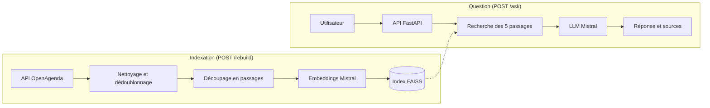

# Assistant IA de recommandation d'événements (RAG)

Assistant conversationnel qui répond en langage naturel à partir de **données réelles** :
environ 7 000 événements culturels de Nouvelle-Aquitaine issus de l'open data OpenAgenda.
Le modèle ne répond qu'à partir des événements retrouvés, **cite ses sources** et dit clairement
quand rien ne correspond, au lieu d'inventer.

> **Question** : « Quels concerts de jazz à Bordeaux ? »
>
> **Réponse** : « Il y a Les Vendredis chez Calixte le 19 juin 2026, Petit concert de Jazz, Quatuor Trombones Jazz à Bordeaux », avec la liste des événements sources (titre, ville, lien).

Le même principe s'applique à n'importe quelle base de connaissances : documentation interne,
catalogue produits, FAQ, contrats, tickets de support.

## Fonctionnalités

- **Ingestion des données** : récupération via l'API OpenAgenda (Opendatasoft), nettoyage, validation et dédoublonnage.
- **Indexation vectorielle** : découpage en passages, embeddings `mistral-embed`, index FAISS persisté sur disque.
- **Génération augmentée** : recherche des 5 passages les plus proches, puis réponse rédigée par `mistral-small` à partir de ces seuls passages.
- **API REST** : FastAPI avec documentation Swagger, gestion d'erreurs explicite et endpoint de reconstruction protégé par clé.
- **Évaluation automatique** : jeu de questions annotées à la main et métriques Ragas.
- **Déploiement** : image Docker et Docker Compose, dépendances verrouillées avec uv.

## Architecture



## Résultats

| Étape | Volume |
| ----- | ------ |
| Événements récupérés | 10 000 |
| Après nettoyage et dédoublonnage | 7 063 |
| Passages indexés | 10 551 |

Évaluation Ragas sur 10 questions annotées à la main (juge : `mistral-small`) :

| Métrique | Score | Ce qu'elle mesure |
| -------- | ----- | ----------------- |
| Faithfulness | 0.830 | La réponse est-elle appuyée par les sources ? |
| Answer relevancy | 0.830 | La réponse répond-elle à la question ? |
| Context precision | 0.820 | Les passages retrouvés sont-ils pertinents ? |

Une question hors périmètre (« Y a-t-il des concerts à Paris ? ») est correctement refusée, sans
inventer d'événement. Ragas lui donne pourtant 0 en fidélité, car la métrique pénalise les refus :
c'est une limite connue de Ragas, pas du système.

## Stack technique

Python 3.13, LangChain, FAISS, Mistral AI (`mistral-embed`, `mistral-small-latest`), FastAPI,
Uvicorn, Pydantic, Ragas, Pytest, Docker, uv.

## Démarrage rapide (Docker)

Prérequis : Docker et une clé API Mistral (gratuite sur [console.mistral.ai](https://console.mistral.ai)).

Créez un fichier `.env` à la racine :

```bash
MISTRAL_API_KEY=votre_cle_mistral
MISTRAL_CHAT_MODEL=mistral-small-latest
MISTRAL_EMBED_MODEL=mistral-embed
ADMIN_API_KEY=une_cle_admin_de_votre_choix
```

Puis :

```bash
docker compose up -d --build
```

L'API est disponible sur `http://localhost:8000`, avec sa documentation interactive sur `http://localhost:8000/docs`.

Au premier lancement, construisez l'index (téléchargement des données et calcul des embeddings, quelques minutes) :

```bash
curl -X POST http://localhost:8000/rebuild -H "X-API-Key: une_cle_admin_de_votre_choix"
```

Posez ensuite une question :

```bash
curl -X POST http://localhost:8000/ask \
  -H "Content-Type: application/json" \
  -d '{"question": "Quels concerts de jazz à Bordeaux ?"}'
```

> Sous Windows (PowerShell), le plus simple est d'appeler `/rebuild` et `/ask` depuis la page Swagger (`/docs`).

## Lancement en local, sans Docker

Prérequis supplémentaires : Python 3.13+ et [uv](https://docs.astral.sh/uv/).

```bash
uv sync
uv run python scripts/fetch_data.py     # récupère les événements
uv run python scripts/build_index.py    # construit l'index FAISS
uv run uvicorn src.api.app:app --reload # lance l'API
```

## Endpoints

| Méthode | Route | Description |
| ------- | ----- | ----------- |
| `GET` | `/health` | Vérifie que l'API répond |
| `POST` | `/ask` | Pose une question, renvoie la réponse et ses sources |
| `POST` | `/rebuild` | Rafraîchit les données et reconstruit l'index (protégé par `X-API-Key`) |
| `GET` | `/docs` | Documentation Swagger interactive |

Codes d'erreur : `422` question vide, `503` index non construit, `401` clé admin invalide, `500` erreur de génération.

## Tests et évaluation

```bash
uv run pytest                            # tests unitaires et tests de l'API
uv run python scripts/evaluate_rag.py   # évaluation Ragas sur data/eval/questions.jsonl
```

## Structure du projet

```
├── src/
│   ├── data/          # collecte et nettoyage des données OpenAgenda
│   ├── vectorstore/   # documents LangChain, découpage, index FAISS
│   ├── rag/           # chaîne RAG : recherche, prompt, génération
│   └── api/           # application FastAPI
├── scripts/           # récupération des données, indexation, évaluation
├── tests/             # tests Pytest
├── data/eval/         # jeu d'évaluation annoté
├── docs/              # rapport technique détaillé
├── Dockerfile
└── docker-compose.yml
```

## Pistes d'amélioration

Historique de conversation, filtrage des événements passés, extension à d'autres régions,
index managé et cache pour une mise en production à grande échelle.
